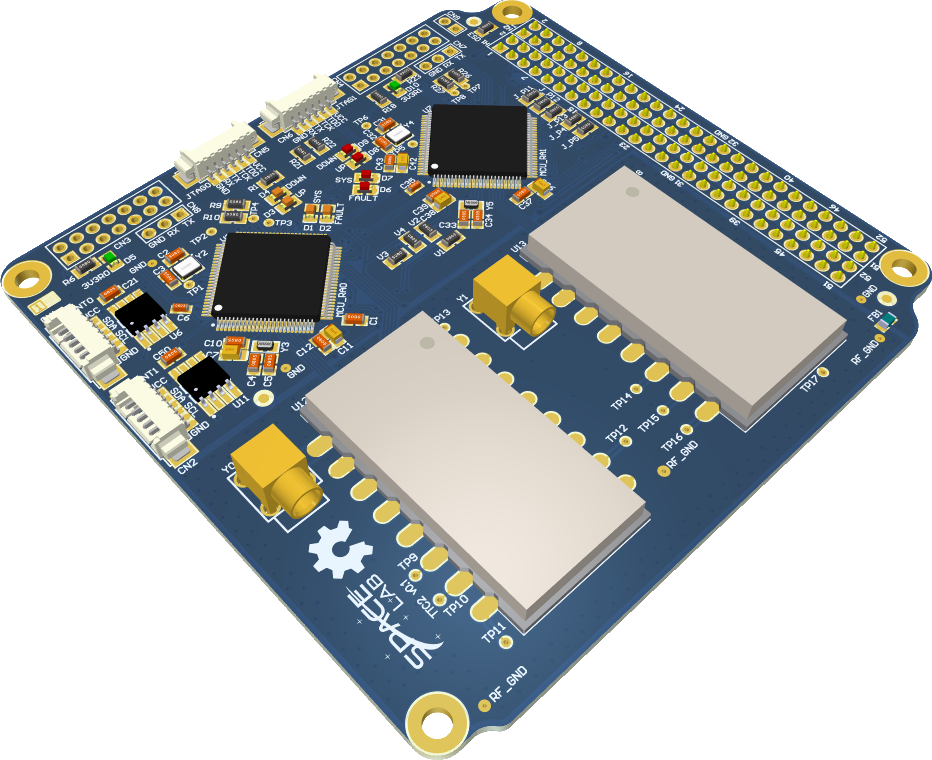

<h1 align="center">
    CUBE-SAT PACKET PIPELINE
    <br>
</h1>
<h4 align="center">Payload packet handling pipeline for the S-band Transmitter, developed by Hardik Singhal, Shivansh Gupta, and Amrit Mishra as SpaceLab summer interns, under the mentorship of Lucas Ryan.</h4>

<p align="center">
    <a href="https://github.com/spacelab-ufsc/S-band-transmitter">
        
    </a>
    <a href="https://freertos.org">
        
    </a>
    <a href="https://mgm8.github.io/pyngham/">
        
    </a>
    <a href="#contributors">
        
    </a>
</p>

<p align="center">
    <a href="#overview">Overview</a> •
    <a href="#architecture">Architecture</a> •
    <a href="#building--running">Building & Running</a> •
    <a href="#documentation">Documentation</a> •
    <a href="#license">License</a>
</p>

<p align="center">
    
</p>

## Overview

This module implements the packet handling pipeline for the S-band Transmitter payload: reading payload data, fragmenting it into transmission-sized chunks, ordering it through a FIFO queue, encoding it into NGHam frames, and monitoring pipeline telemetry (queue occupancy, generation/transmission rates, overflow counts). It is implemented as four FreeRTOS tasks and validated on the FreeRTOS POSIX/Linux simulator prior to MCU integration.

## Architecture

The pipeline is split into four FreeRTOS tasks, connected by two queues:

1. **Payload Reader / Fragmenter** — reads payload data per occultation event and splits it into fixed-size chunks.
2. **FIFO Queue Manager** — forwards chunks in order, preserving transmission sequence.
3. **NGHam Encoder** — serializes and encodes each chunk into a transmittable NGHam frame (CRC16 + Reed-Solomon FEC).
4. **Telemetry Monitor** — samples queue occupancy and updates generation/transmission rates and overflow counters in a shared, mutex-protected telemetry struct.

## Building & Running

```bash
cd firmware
make
./build/telemetry_pipeline
```

## Documentation

Protocol notes (NGHam packet structure, SPP, extension packets) and FreeRTOS reference material are available in [`doc/`](doc).


## License

This project is open-source under two licenses: GNU General Public License v3.0 for firmware sources, and CC BY-SA 4.0 for the documentation. Some third-party files and libraries (e.g. the FreeRTOS kernel) are subject to their own specific terms and licenses.
