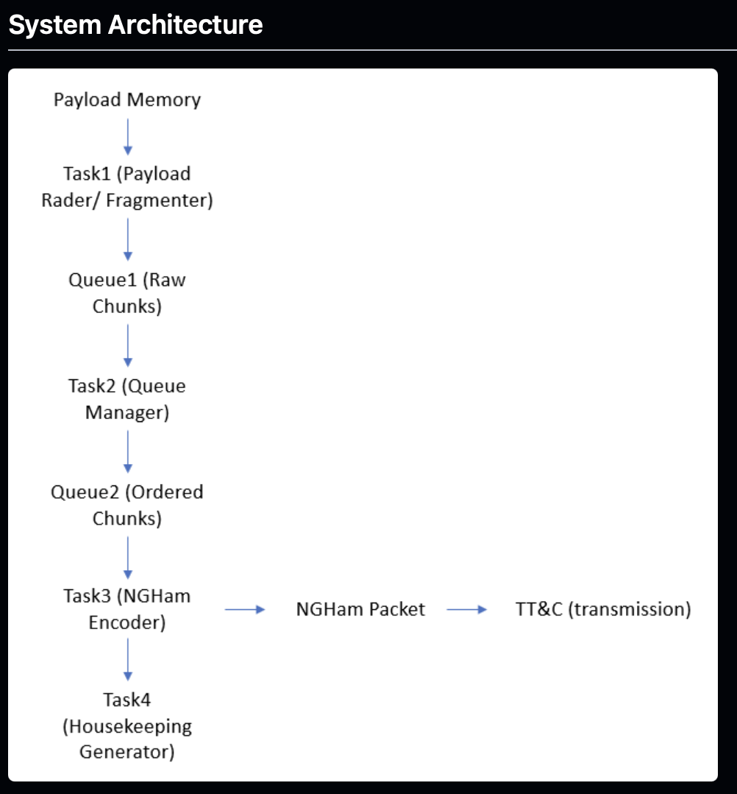

# Packet pipeline architecture

Documents the design of the CubeSat packet pipeline: four FreeRTOS tasks handling payload fragmentation, queuing, NGHam encoding, and housekeeping telemetry.



## Contents

1. [Payload fragmentation and NGHam encoding (Tasks 1–3)](payload-fragmentation-and-ngham-encoding.md)
2. [Housekeeping / telemetry module (Task 4)](housekeeping-telemetry.md)

## Data flow
```Payload Memory
|
v
Task 1 (Payload Reader / Fragmenter)
|
v
Queue 1 (Raw Chunks)
|
v
Task 2 (Queue Manager)
|
v
Queue 2 (Ordered Chunks)
|
v
Task 3 (NGHam Encoder) ---> NGHam Packet ---> TT&C (transmission)
|
v
Task 4 (Housekeeping Generator)
```
---

Developed by Shivansh Gupta ([@shivanshgupta020905](https://github.com/shivanshgupta020905), 24uec228@lnmiit.ac.in), and Amrit Mishra, as SpaceLab summer interns under the mentorship of Lucas Ryan.
