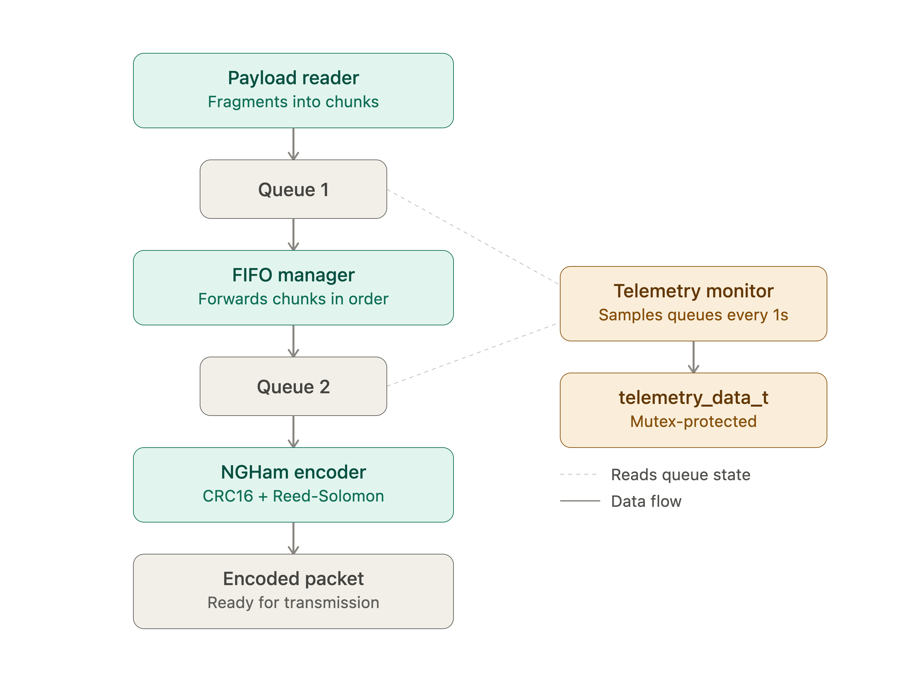

<h1 align="center">
    <br>
    CUBESAT-PIPELINE FIRMWARE
    <br>
</h1>

<h4 align="center">Payload fragmentation, queuing, NGHam encapsulation, and telemetry monitoring firmware (sources, configs and documentation).</h4>

<p align="center">
    <a href="https://github.com/spacelab-ufsc/S-band-transmitter">
        
    </a>
    <a href="https://devdocs.io/c">
    
    </a>
        <a href="https://freertos.org">
        
    </a>
    <a href="https://freertos.org/Documentation/02-Kernel/03-Supported-devices/04-Demos/03-Emulation-and-simulation/Linux/FreeRTOS-simulator-for-Linux">
    
    </a>
    <a href="../LICENSE">
        
    </a>
</p>

<p align="center">
    <a href="#overview">Overview</a> •
    <a href="#pipeline-tasks">Pipeline Tasks</a> •
    <a href="#directory-structure">Directory Structure</a> •
    <a href="#dependencies">Dependencies</a> •
    <a href="#development">Development</a> •
    <a href="#status">Status</a> •
    <a href="#license">License</a>
</p>
<p align="center">
    
</p>

<br>

## Overview

This firmware implements a payload data pipeline for occultation event data, built as four independent FreeRTOS tasks communicating through queues. It reads payload data, splits it into fixed-size chunks, forwards them through a FIFO queue manager, encodes each chunk into an NGHam packet (CRC16 + Reed-Solomon FEC + framing), and reports live telemetry (queue occupancy, generation/transmission rates, overflow counts). Developed during a Summer Internship at SpaceLab (UFSC).

The programming language used is C. The firmware currently runs on the FreeRTOS POSIX/Linux simulator, used for development and logic verification before porting to the MSP430 target hardware.

## Pipeline Tasks

1. **Task 1 — Payload Reader / Fragmenter**: reads occultation event data, splits it into 32-byte chunks, pushes them into Queue 1.
2. **Task 2 — FIFO Queue Manager**: drains Queue 1, forwards to Queue 2, preserving order.
3. **Task 3 — NGHam Encoder**: drains Queue 2, encodes each chunk into an NGHam frame (CRC16 + Reed-Solomon FEC + framing).
4. **Task 4 — Telemetry Monitor**: samples queue occupancy and reports generation/transmission rates once per second.

## Directory Structure

```
firmware/
├── app/structs/     - Payload chunk and telemetry data type definitions
├── config/          - FreeRTOSConfig.h
├── drivers/ngham/   - NGHam packet encoder
├── freertos/        - FreeRTOS kernel + POSIX simulator port
├── main.c           - Entry point, task creation
└── Makefile
```

## Dependencies

* GCC
* POSIX threads (`pthread`)
* FreeRTOS kernel (bundled under `freertos/`)

## Development

#### Toolchain setup

No IDE installation is required for the current development stage. Only a standard GCC toolchain and POSIX threads support are needed (available by default on Linux and macOS).

#### Compiling and building

Clone this repository, then from the `firmware/` directory:

```
make clean && make
```

#### Running

```
./build/telemetry_pipeline
```

Or in one step:

```
make run
```

#### Debugging

Since this firmware currently targets the FreeRTOS POSIX simulator rather than real MSP430 hardware, debugging is done directly through terminal output (`printf`-based logging from each task), rather than a JTAG/MSP-FET hardware debug session. Real-hardware debugging instructions will be added once the firmware is ported to the MSP430 target.

## Status

In development — currently validated end-to-end on the POSIX simulator (payload fragmentation, FIFO ordering, NGHam encapsulation, and telemetry all verified). MSP430 target port pending.

## Contributors

- [Hardik Singhal](https://github.com/GoldernHaze/)
- [Shivansh Gupta](https://github.com/shivanshgupta020905)
- [Amrit Mishra](https://github.com/Amrit14feb/)

**Mentor:** [Lucas Ryan](https://github.com/SPHINXLRC)
## License

The firmware of this project is licensed under the GPLv3 license — see [`LICENSE`](../LICENSE).
